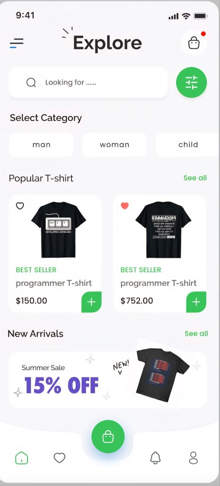
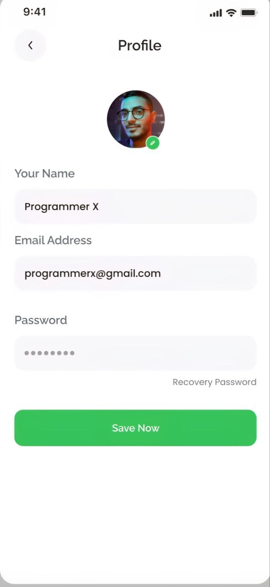
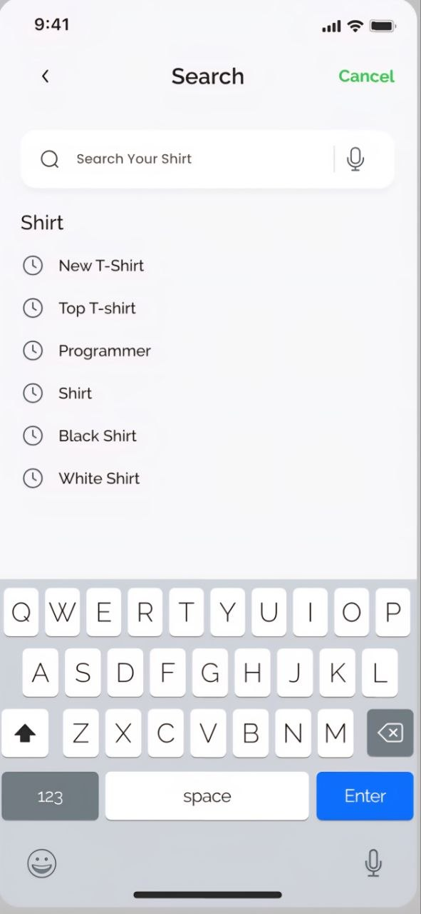
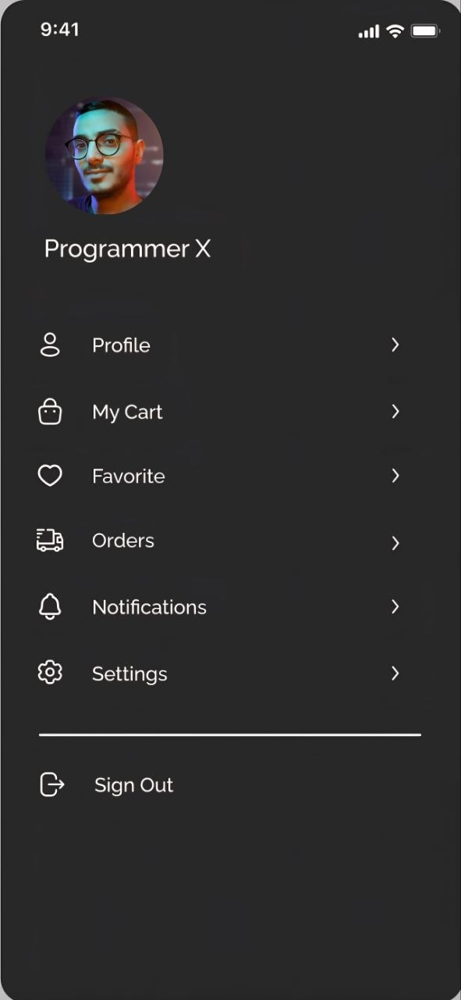

# 📱 Flutter Team Project

A professional collaborative Flutter application developed as part of a team project.  
The project focuses on clean architecture, reusable components, and delivering a smooth user experience.

---

## 🛠 Tech Stack


- Flutter (UI Framework)
- Dart (Programming Language)
- Material Design
- Git & GitHub (Version Control)

---

## 👩‍💻 My Contribution

As part of the development team, I contributed to:

- 🏠 Home Screen implementation  
- 👤 Profile Screen development  
- 🔍 Search Screen development  
- 📂 Side Navigation Menu (Drawer)  
- ♻️ Reusable UI components  
- 🤝 Team collaboration using Git & GitHub (branching, pull requests, code reviews)

---

## 🧠 Architecture

The project is structured with scalability and maintainability in mind:

- Presentation Layer (UI Screens)
- Reusable Widgets
- State Management (Cubit / setState depending on implementation)
- Clean separation between UI and logic

---

## 🚀 Features

- Clean and modern UI design
- Responsive layouts across screens
- Navigation drawer for smooth navigation
- Search functionality
- Reusable components for scalability
- Organized project structure

---

## 📱 Screenshots

### 🏠 Home Screen


### 👤 Profile Screen


### 🔍 Search Screen


### 📂 Side Menu


---

## ▶️ How to Run the Project

```bash
flutter pub get
flutter run
